### Techstack
- react.js
- react bootstrap
- axios
- react hook form
- zod
- moment
- xlsx

### Step to run local
1. clone file .env.example to .env
2. add backend env to `REACT_APP_BACKEND_URL`
3. run `npm install`
3. run `npm start`

### Feature

#### 1. Register
- Form validation exist in both frontend and backend using zod validation
- Form validation will active when user click the form (validation from frontend) or click the submit button (validation from backend)

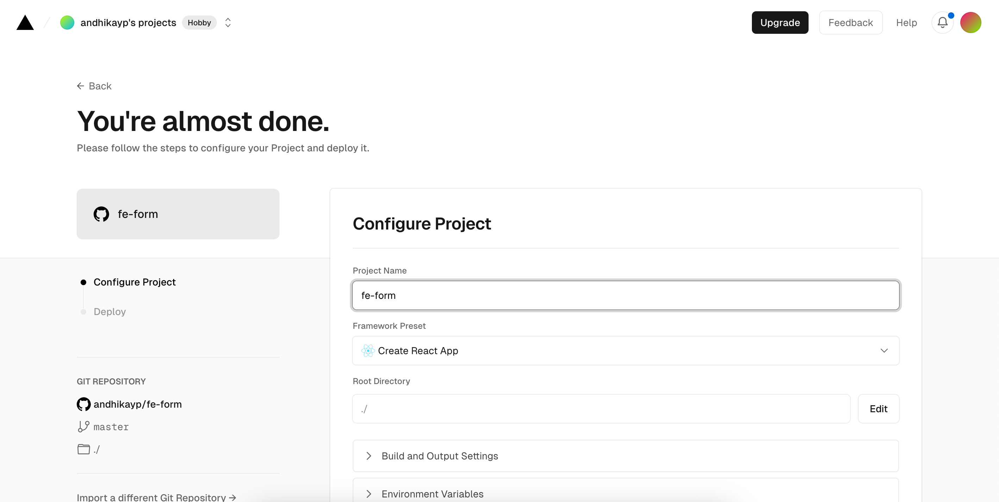
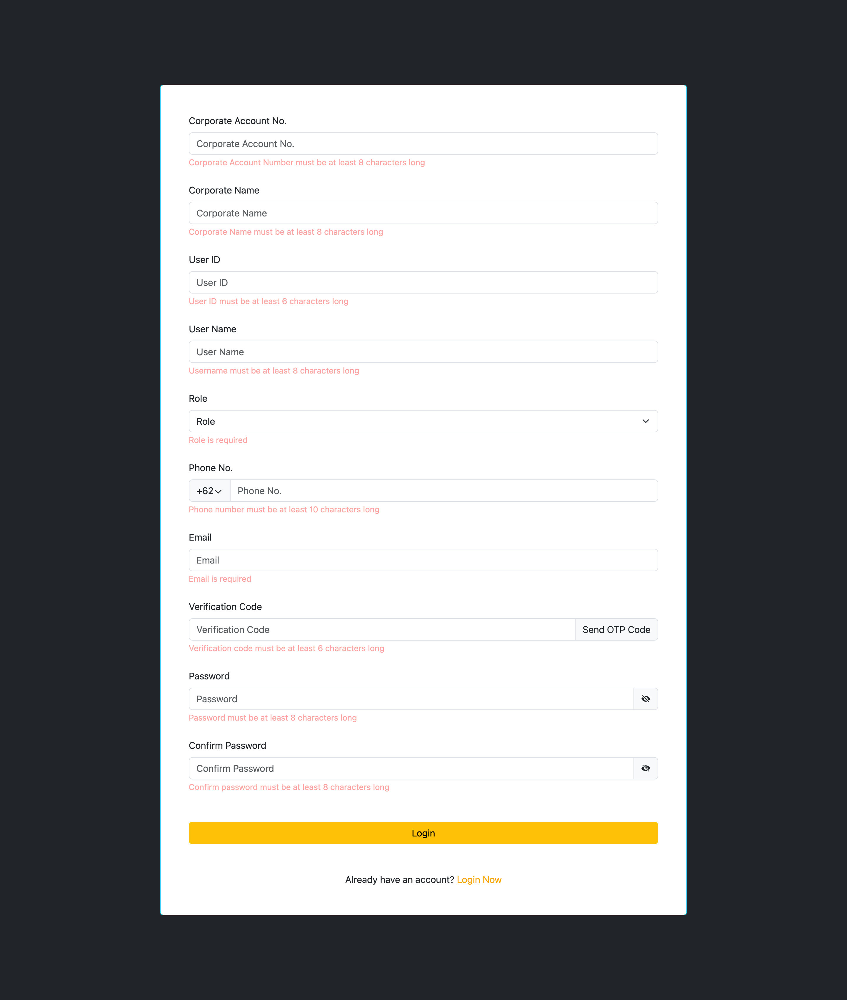

- It will trigger backend to send the email when user click `Send OTP Code`. If user don't input the email before click it, it will trigger validation error form backend.

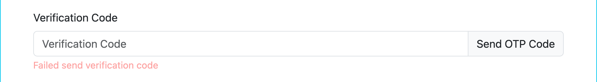

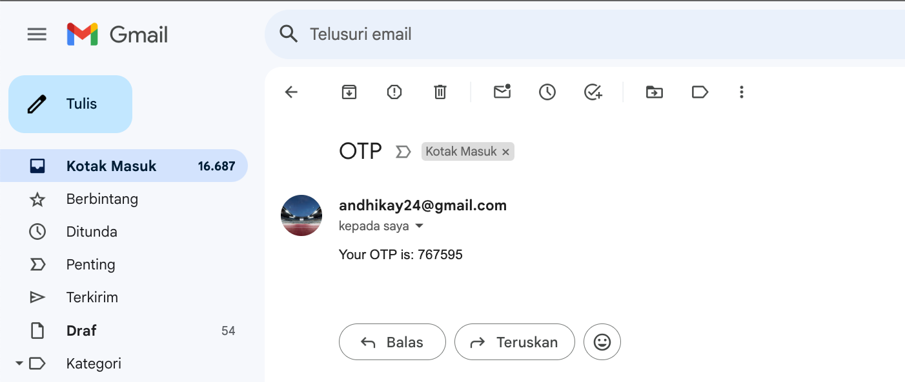

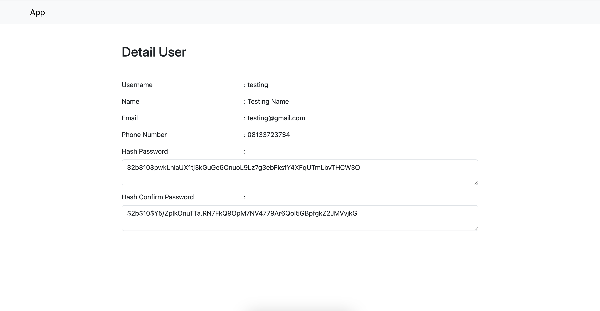

- after successfully register, the data will be saved to database and user will automatically redirect to dashboard. It will get access token, user data, and company data that saved in local storage. The access token will be used for making the api request to authenticate the user and their access.

#### 2. Dashboard
- if the user still have the access token, user can stay in the authenticate url or access the url that they eligible for. If user don't have the access token they will be redirected to login page 
- empty state condition
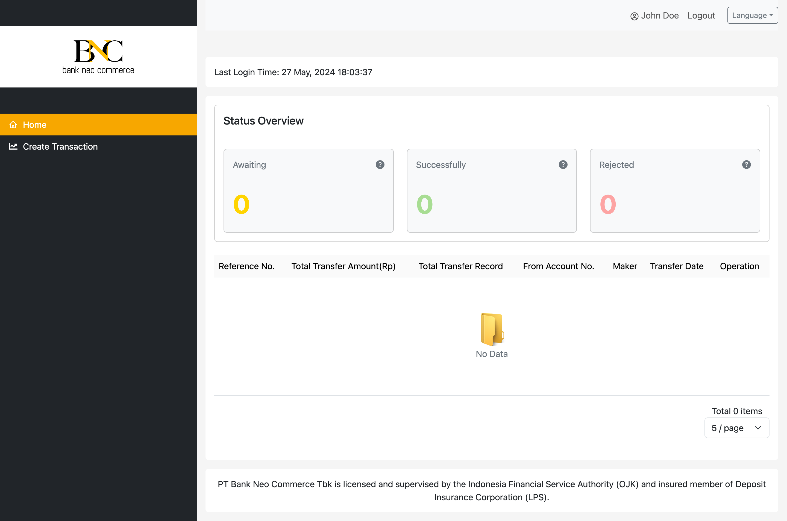

##### Maker
- 

#### 3. Create Transaction
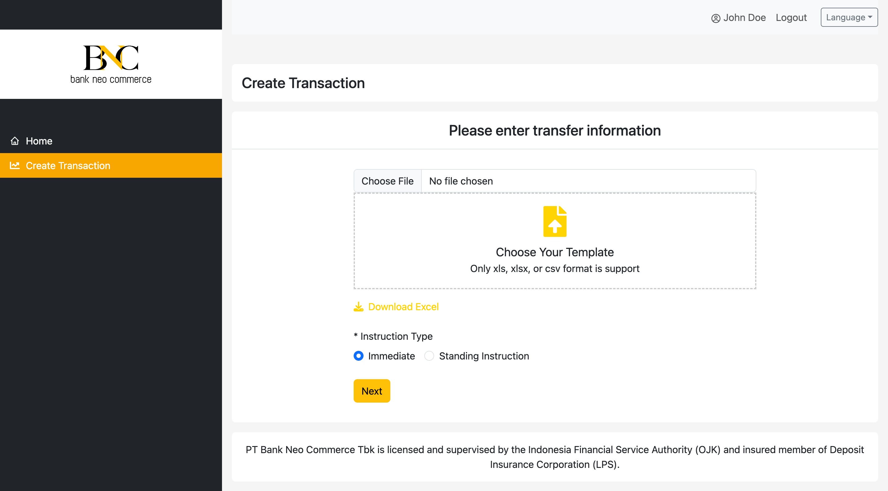

- only for `MAKER` role. If `APPROVER` wants to access the url directly, they will be redirected to home url
- after rendering the page, user can see `Immediate` instruction type is automatically checked
- user can download the excel format and edit it.
- user can upload file with format xlsx, xls, or csv
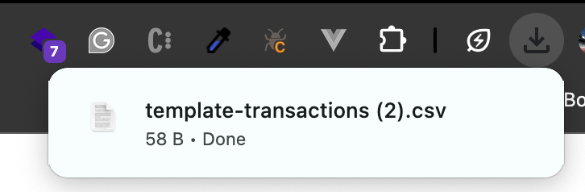
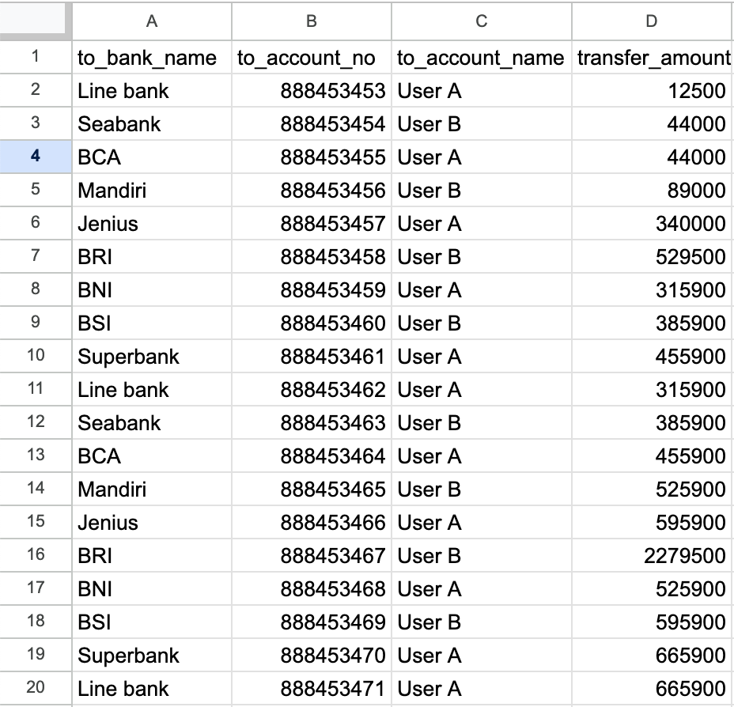
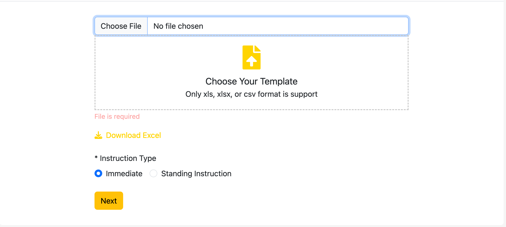
- after successfully upload the file, system will check the input from user
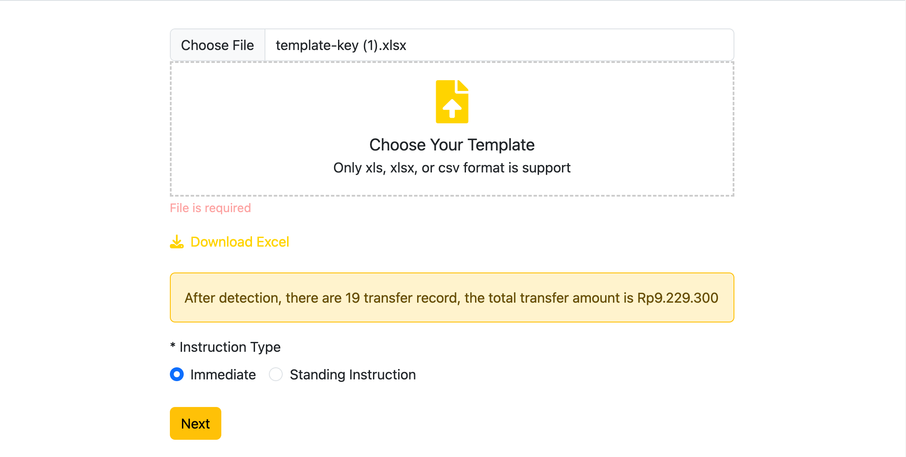
- if there is an error when uploading excel, user will be notified
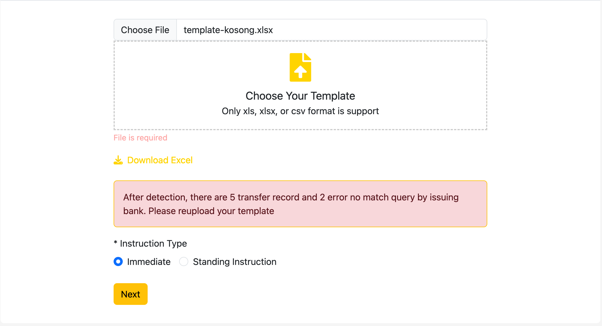
- if user click the `Standing Instruction` radio button, then it will show transfer date input and transfer time input
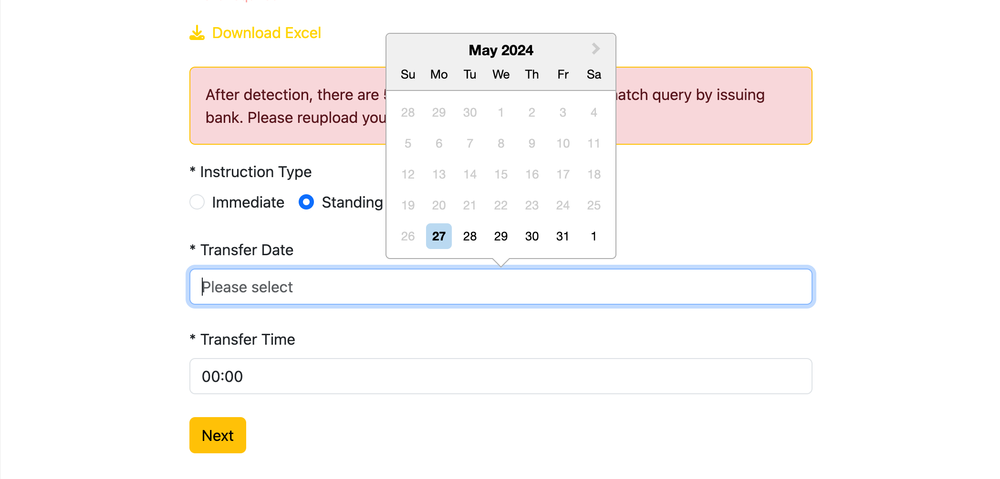  
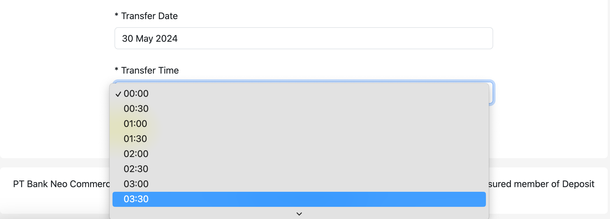

- After passing the validation, user will continue to continue `Confirmation Page`
- If user click `Confirm` button, it will redirect to `Inflight Payment Page`

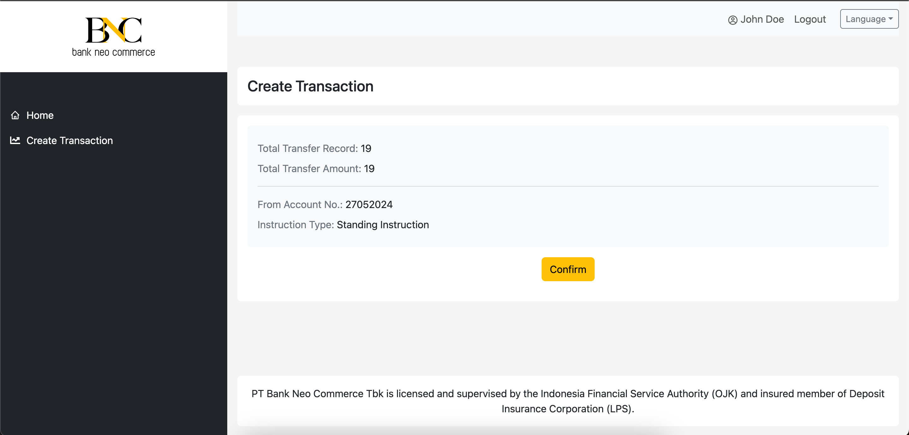

- In `Inflight Payment Page`, user can see the summary of that transactions

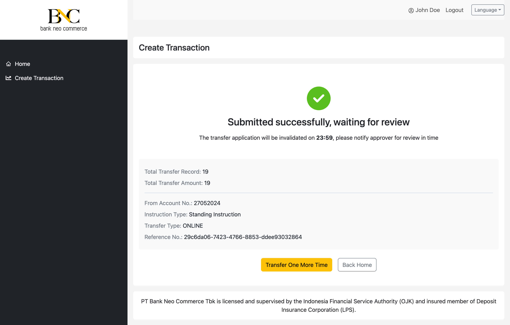

- If they back to home page, they can see the transaction in transaction list table with pending approval

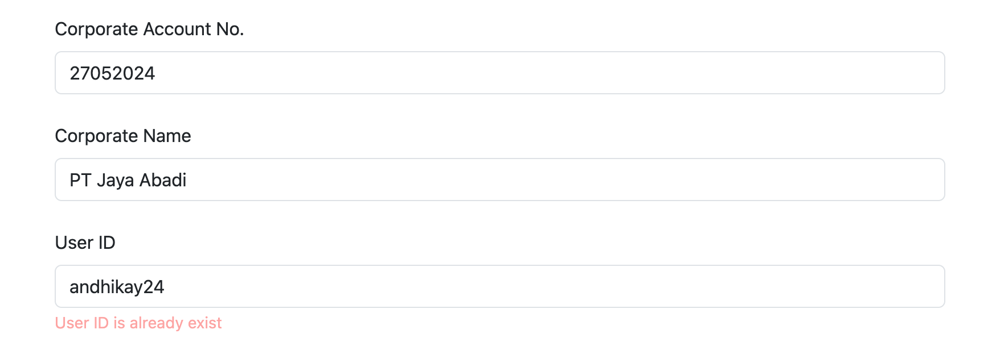

- When click the `Detail`, user can see the full page popup containing transaction detail
