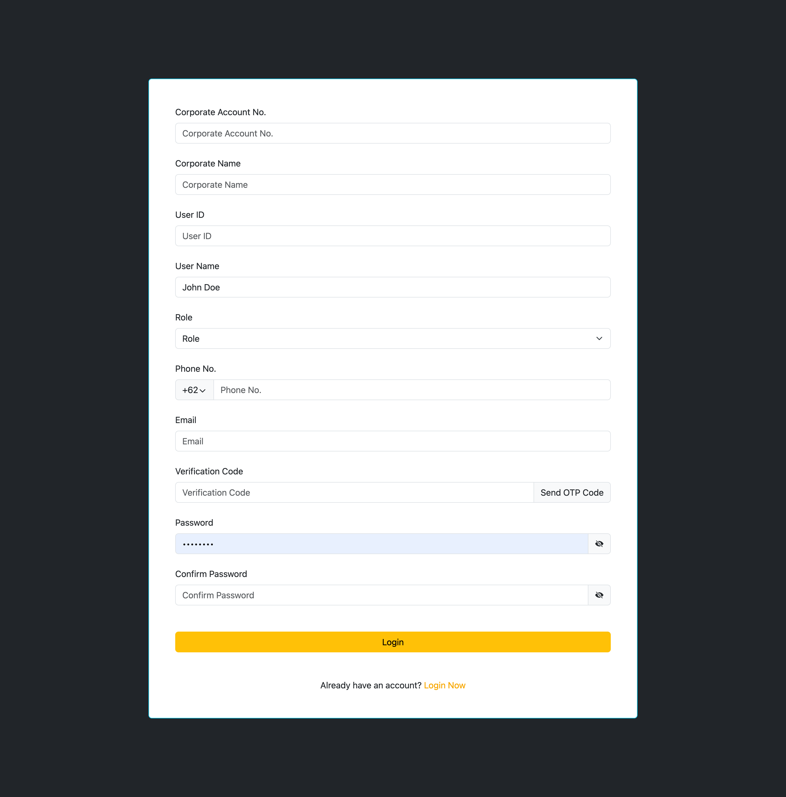

# Documentation

## Form validation

Form validation is handled from frontend and backend

```
const REGISTER = z
  .object({
    username: z
      .string()
      .min(6, { message: 'Username must be at least 6 characters long' })
      .max(30, { message: 'Username must be at most 30 characters long' })
      .and(startsWithLetterSchema)
      .and(validCharactersSchema),
    email: z.string().min(1, { message: 'Email has to be filled' }).email(),
    password: z
      .string()
      .min(8, { message: 'Password must be at least 8 characters long' })
      .max(100, { message: 'Password must be at most 100 characters long' }),
    confirmPassword: z
      .string()
      .min(8, {
        message: 'Confirm password must be at least 8 characters long',
      })
      .max(100, {
        message: 'Confirm password must be at most 100 characters long',
      }),
    name: z
      .string()
      .min(1, { message: 'Name has to be filled' })
      .max(100, { message: 'Name must be at most 100 characters long' })
      .regex(/^[a-zA-Z\s]*$/, 'Name must contain only letters and blank spaces'),
    phoneNumber: z
      .string()
      .min(10, {
        message: 'Phone number must be at least 10 characters long',
      })
      .max(12, { message: 'Phone number must be at most 12 characters long' })
      .regex(/^[0-9]+$/, {
        message:
          'Phone number must be a valid indonesian number',
      }),
  })
  .refine((data) => data.password === data.confirmPassword, {
    message: 'Password must match',
    path: ['confirmPassword'],
  });
```

## Question

##### 1. how would you approach designing a layout that maintains consistency and usability across different screen sizes, from desktops to smartphones?

responsive design requires careful planning and consideration. Here's my approach:
- Use a responsive framework: I consider using a CSS framework like Bootstrap, Foundation, or Material-UI that provides a grid system and components specifically designed for responsive layouts. These frameworks help me ensure consistency and usability across different screen sizes. I use a responsive framework on the project that needs to finish immediately. But on my current project’s job, I must styling the website from scratch
- Mobile-First Approach: If I must start creating responsive layout from scratch, I start by designing for the smallest screen size (e.g., smartphones) and then progressively enhance the layout for larger screen sizes. This approach ensures that the design is optimized for mobile devices and gracefully scales up to desktops.
- Fluid Layouts: Use percentage-based widths for the layout containers and elements instead of fixed pixel widths. This allows layout to adapt fluidly to different screen sizes.
- Media Queries: Use CSS media queries to apply specific styles based on the screen size. I can define different font sizes, margins, or padding for different screen sizes to ensure readability and spacing.
- Flexible Images and Media: I use max-width: 100%; for images and media elements to ensure they scale down proportionally on smaller screens.
- Testing: After applying all the methods that I mentioned before, the next step is test and check layout on actual devices and emulators to ensure that it looks and functions as expected across different screen sizes and resolutions

##### 2. Explain how to deploy the website in the webhoster!

I deploy it on vercel - https://vercel.com/
Step to deploy:
1. Login to vercel using github
2. On the dashboard, add new project that want to deploy
3. Import from git repository
4. Configure project

5. Klik deploy and wait until success

## Result


https://fe-form-andhikayps-projects.vercel.app/
